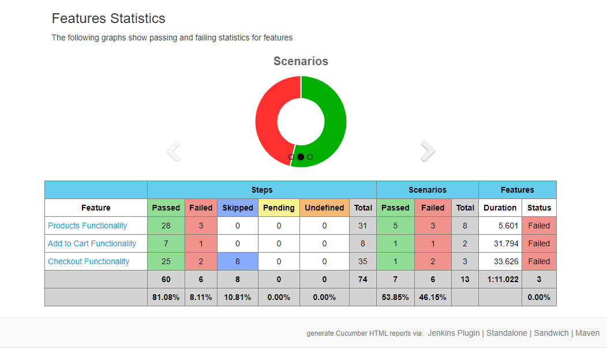
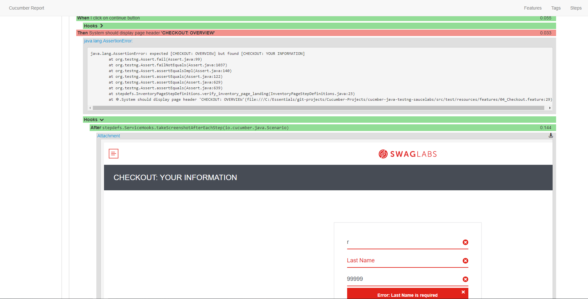

[](https://github.com/youvegotnigel/cucmber-java-testng-saucelabs/actions/workflows/maven.yml)

## How to run

type
```bash
mvn clean verify -Dtestng.dtd.http=true -Dmaven.test.failure.ignore=true
```
in terminal

## Main Features
* Selenium
* Java
* TestNG
* Page Object Model
* [Log4j 2](https://logging.apache.org/log4j/1.2/apidocs/org/apache/log4j/PatternLayout.html)
* Capture Screenshots
* Cucumber BDD Framework
* Cucumber HTML Report
* [Allure Report](https://docs.qameta.io/allure/)


## Report Highlights

* Feature overview:
  <br>
    


* Capture error with screenshots:
  <br>
    

[Latest Report is Here🙂](https://youvegotnigel.github.io/cucmber-java-testng-saucelabs/)

## Author
* **Nigel Mulholland** - [Linkedin](https://www.linkedin.com/in/nigel-mulholland/) 